<p align="center">
  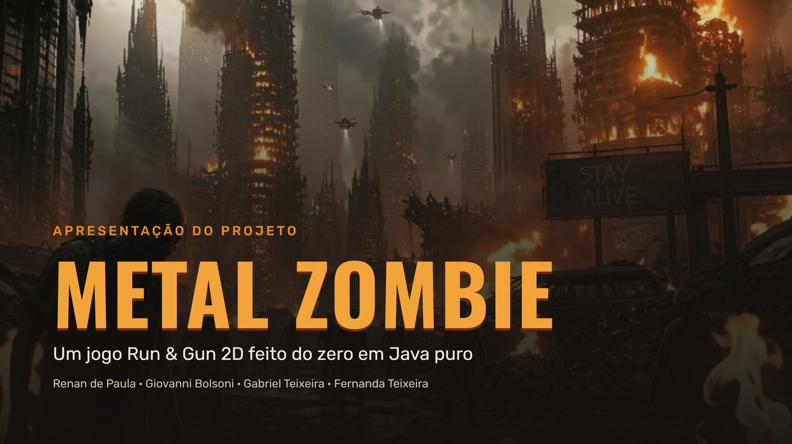
</p>

<p align="center">
  
  
  
  
</p>

> [!IMPORTANT]
> **O jogo está na pasta [`novojogo/`](novojogo).**
> Os arquivos da raiz (`index.html`, `src/`, `package.json`) e a pasta `java-version/` são **protótipos antigos** e não são o jogo da apresentação.

---

## 💡 A ideia

Fazer um jogo de ação no estilo **Metal Slug** sem usar nenhuma engine pronta. Tudo foi programado na mão: a janela, o desenho na tela, a física, os inimigos, os chefes, o som e até parte dos desenhos.

| ☕ Java 21 | 🗺️ 3 fases | 💀 3 chefes |
|:---:|:---:|:---:|
| puro, com Swing e Java2D | de 1.000 metros cada | um no fim de cada fase |

---

## 📖 A história

O vírus **SDNA** derruba a cidade. **Elias Rocha**, mecânico e eletricista, foge com a família para o Vale do Cedro e transforma uma casa velha em abrigo. Quando a horda ataca, sua esposa Marina é ferida e a filha, Lívia, é levada. Agora ele parte para buscá-la.

<table>
  <tr>
    <td align="center" width="33%">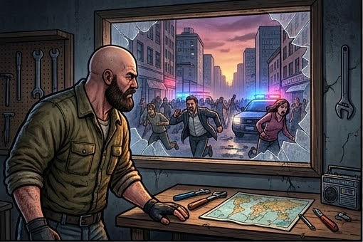<br><sub><b>1.</b> O vírus SDNA derruba a cidade</sub></td>
    <td align="center" width="33%">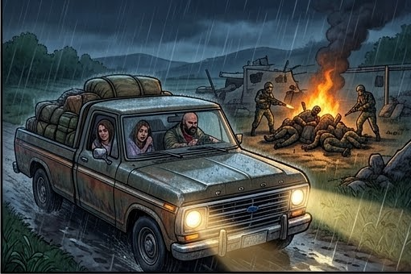<br><sub><b>2.</b> A família foge para o Vale do Cedro</sub></td>
    <td align="center" width="33%">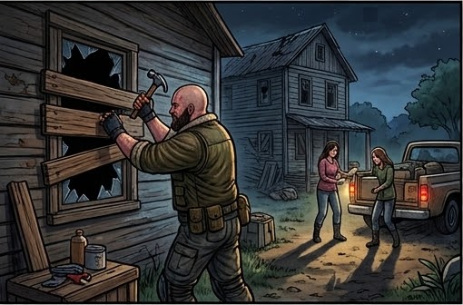<br><sub><b>3.</b> Elias transforma a casa em abrigo</sub></td>
  </tr>
  <tr>
    <td align="center">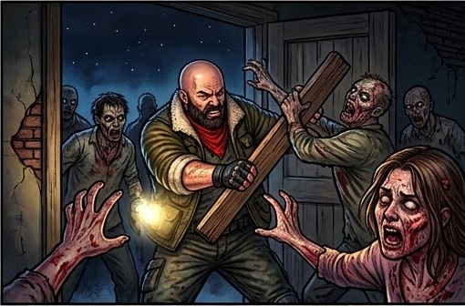<br><sub><b>4.</b> A horda ataca e Marina é ferida</sub></td>
    <td align="center">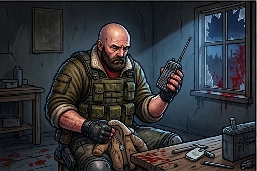<br><sub><b>5.</b> Lívia, a filha, é levada</sub></td>
    <td align="center">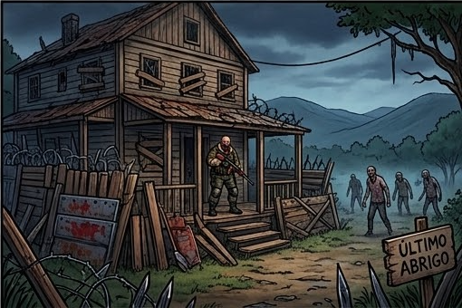<br><sub><b>6.</b> Ele parte para buscá-la</sub></td>
  </tr>
</table>

> *"Eles levaram a única coisa que me restava... e eu vou até o inferno para buscá-la."*
> **— Elias Rocha**

---

## 🎮 Como se joga

<p align="center">
  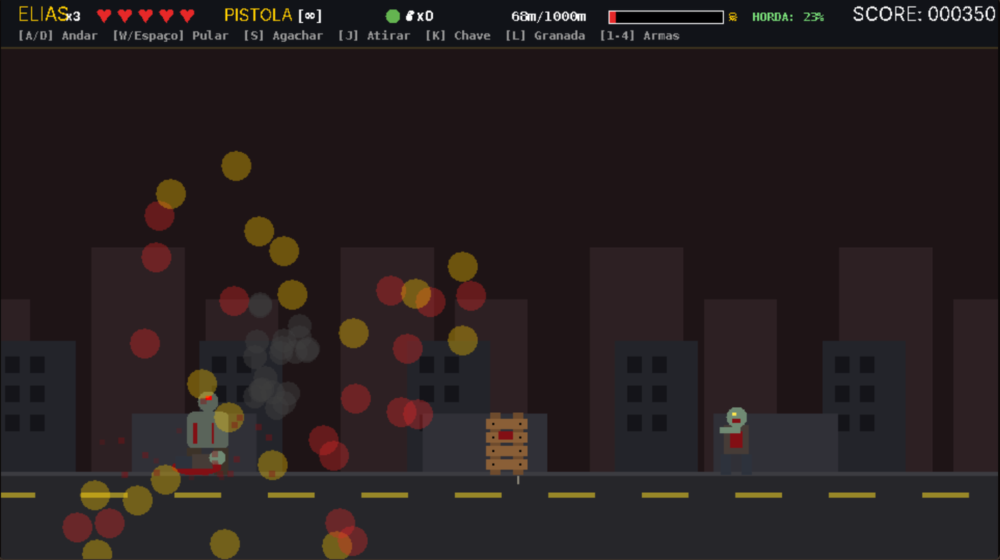<br>
  <sub>Fase 2 rodando: barra de vida, arma, metros percorridos e pontuação no topo</sub>
</p>

| Tecla | Ação |
|:---:|---|
| `A` / `D` | Andar |
| `W` | Mirar para cima |
| `S` | Agachar |
| `Espaço` | Pular |
| `J` | Atirar |
| `K` | Chave inglesa |
| `L` | Granada |
| `1` a `4` | Trocar arma |
| `Esc` / `P` | Pausar |

---

## 🗺️ Três fases, três chefes

<table>
  <tr>
    <td align="center" width="33%">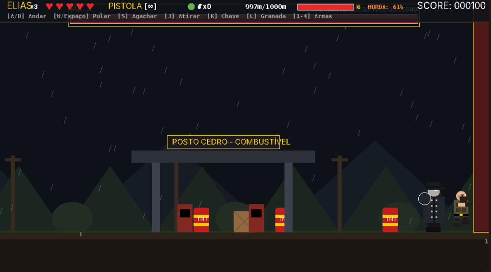</td>
    <td align="center" width="33%">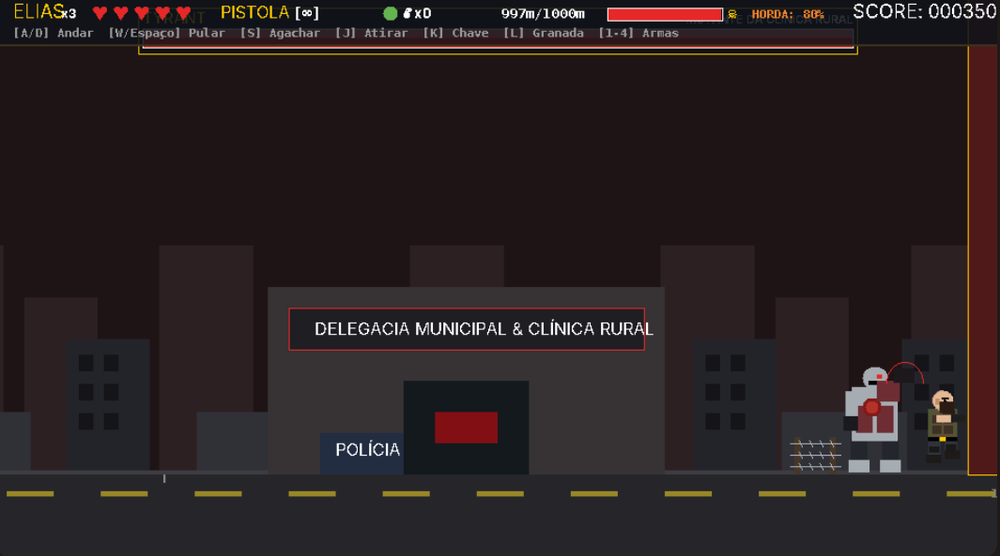</td>
    <td align="center" width="33%">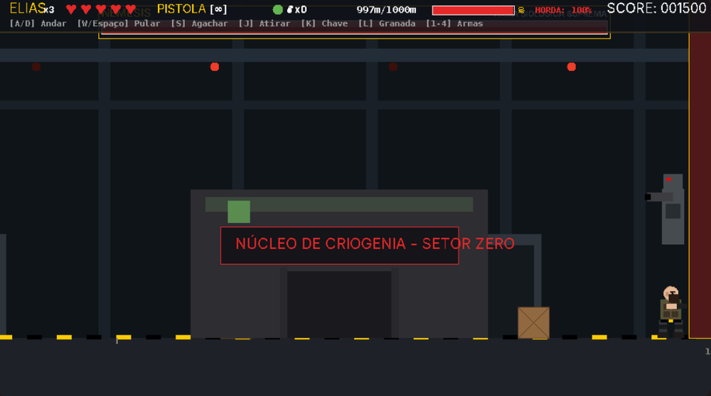</td>
  </tr>
  <tr>
    <td valign="top"><b>Fase 1 · Floresta do Cedro</b><br>Chuva e estrada de terra. Chefe: <b>Mr. X</b>, que fica furioso na segunda fase da luta.</td>
    <td valign="top"><b>Fase 2 · Cidade Velha</b><br>Ruas destruídas e hordas densas. Chefe: <b>Tyrant</b>, com garra gigante e onda de choque.</td>
    <td valign="top"><b>Fase 3 · Bunker e laboratório</b><br>Corredores industriais. Chefe final: <b>Nemesis</b>, com lança-foguetes e tentáculos.</td>
  </tr>
</table>

---

## 🧟 Inimigos e armas

<table>
  <tr>
    <th width="50%">Zumbis</th>
    <th width="50%">Arsenal do Elias</th>
  </tr>
  <tr>
    <td valign="top">
      <b>Caminhante</b>: lento e resistente, ataca dos dois lados.<br>
      <b>Corredor</b>: rápido, se agacha antes de dar o bote.<br>
      <b>Tanque</b>: avança em hordas e ataca de perto.<br><br>
      Além deles: barris explosivos, arame farpado, poças tóxicas e barricadas.
    </td>
    <td valign="top">
      <b>Pistola</b>: munição infinita.<br>
      <b>Escopeta</b>: tiro em leque.<br>
      <b>Fuzil</b>: alta cadência.<br>
      <b>Lança-chamas</b>: dano contínuo.<br><br>
      E mais granadas e a chave inglesa para o corpo a corpo.
    </td>
  </tr>
</table>

---

## 🚀 Como rodar

**Pré-requisitos para compilar:** [JDK 21](https://adoptium.net/temurin/releases/?version=21) e [Maven](https://maven.apache.org/download.cgi).

```bash
# 1. Clone o repositório
git clone https://github.com/Renan-De-Paula/MetalZombieBlast.git
cd MetalZombieBlast/novojogo

# 2. Compile (só precisa uma vez). Gera target/ultimo-abrigo-1.0.0.jar
mvn clean package
```

**3.** Dê dois cliques em **`jogar.bat`**. Na primeira vez, ele baixa sozinho um Java portátil (~45 MB) para a pasta `jre/` e abre o jogo em tela cheia.

> [!TIP]
> **O Windows bloqueou o `jogar.bat`?** Se aparecer *"O Controle de Aplicativo Inteligente bloqueou um arquivo"*, abra o PowerShell dentro da pasta `novojogo` e rode:
> ```powershell
> Get-ChildItem -Recurse | Unblock-File
> ```
> Depois abra o `jogar.bat` de novo.

---

## 🛠️ Como foi feito

Primeiro um plano de 12 etapas (ele está em [`novojogo/plano_de_trabalho.md`](novojogo/plano_de_trabalho.md)), depois uma de cada vez:

| Etapa | O que entrou |
|---|---|
| **01 · Motor** | Janela, loop do jogo a 60 atualizações por segundo e troca de telas |
| **02 · Herói e mundo** | Pulo, tiro em 3 direções, câmera lateral e fundo em camadas |
| **03 · Inimigos** | Zumbis, obstáculos e a curva de dificuldade |
| **04 · Fases e chefes** | Floresta, cidade e bunker, cada uma com seu chefe |
| **05 · História** | Cutscene de abertura com 6 quadros e o final |
| **06 · Acabamento** | Menus, HUD, som, testes e o executável |

### Por dentro do código

| ~7.400 | 45 | 8 |
|:---:|:---:|:---:|
| linhas de Java | classes em 6 pacotes | telas (menu, jogo, pausa...) |

- **Pixel art nítida:** o jogo desenha em 960×540 e amplia sem borrar.
- **Sprites por código:** personagens e cenários desenhados com Java2D.
- **Som sintetizado:** efeitos e música gerados em tempo real.
- **Um arquivo só:** o Maven gera um `.jar` que roda com dois cliques.

### Problemas que apareceram no caminho

| Problema | Solução |
|---|---|
| Tela piscando e retângulos pretos no Windows | Desligamos o Direct3D do Java e passamos a usar OpenGL |
| Itens com fundo branco | Escrevemos um programinha ([`RemoveWhite.java`](novojogo/RemoveWhite.java)) que apaga o branco e deixa o fundo transparente |
| Rodar no computador dos amigos | O `jogar.bat` baixa um Java portátil sozinho na primeira vez e abre o jogo |

---

## 📁 Estrutura do repositório

```
MetalZombieBlast/
├── novojogo/              ← JOGO PRINCIPAL (Java 21 + Maven)
│   ├── src/main/java/     código-fonte (45 classes)
│   ├── src/main/resources imagens e sons
│   ├── ref_art/           artes de referência e quadros da história
│   ├── pom.xml            configuração do Maven
│   └── jogar.bat          abre o jogo
├── docs/img/              imagens deste README
├── java-version/          protótipo antigo em Java
└── src/, index.html       protótipo antigo em JavaScript
```

As pastas `novojogo/jre/` e `novojogo/target/` não vão para o Git, porque são geradas automaticamente.

---

<p align="center">
  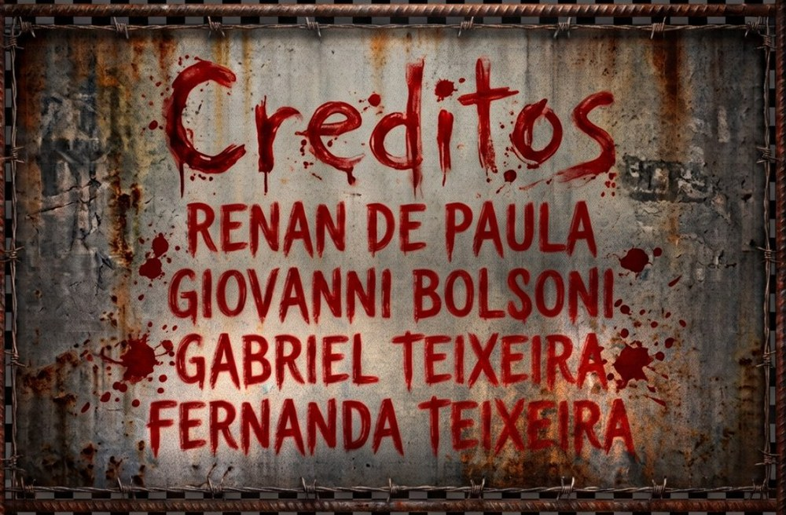
</p>

<p align="center">
  <i>"Enquanto essa casa estiver de pé, ainda existe alguém para salvar."</i>
</p>
